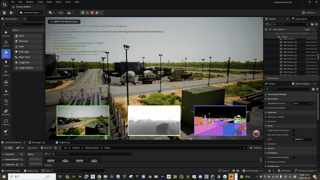
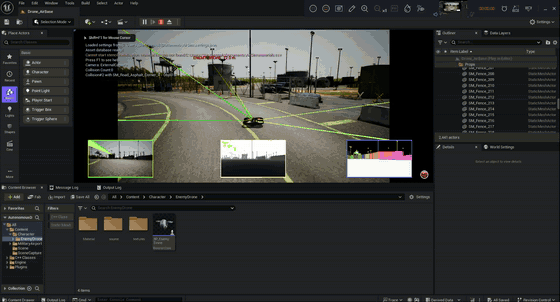

# Autonomous Drone Simulation: Unreal Engine, AirSim, PX4 and Gazebo

## Demo Preview / 데모 미리보기

<table>
  <tr>
    <th>Minimap Navigation / 미니맵 경로 비행</th>
    <th>Enemy Drone Detection / 적 드론 인식</th>
  </tr>
  <tr>
    <td><a href="media/airsim-minimap-navigation-demo.mp4"></a></td>
    <td><a href="media/enemy-drone-detection-demo.mp4"></a></td>
  </tr>
</table>

**Click either animated preview to watch its full MP4. / 움직이는 미리보기 중 하나를 클릭하면 해당 전체 MP4 영상을 볼 수 있습니다.**

## English

This repository documents an evolving autonomous-drone simulation project. The current development focus is an **Unreal Engine 5.5 + Cosys-AirSim** workflow with a Python mission-control application. Earlier PX4 SITL, Gazebo Harmonic, and QGroundControl experiments are retained as a reference but are currently on hold.

> All flight operations in this repository are simulations. This project does not control a real aircraft.

### Current AirSim Work

- Desktop mission-control UI for connection, arming, takeoff, hover, landing, and emergency stop
- Real-time position, velocity, altitude, and attitude telemetry
- RGB, depth, and segmentation views with LiDAR safety sensing
- Clickable AirBase minimap for selecting spawn point A and destination B
- A* waypoint planning with fixed-altitude horizontal detours
- AirSim `moveOnPathAsync()` path execution
- Reactive LiDAR obstacle avoidance, route replanning, and collision recovery
- Planned work on vertical/dynamic obstacle avoidance, object tracking, and tag-based behaviors

### LiDAR Visualization Performance Tuning

During flight testing, continuously rendering the green LiDAR debug points caused the Unreal view to stutter and appear to shake. The LiDAR sensor remains enabled for obstacle detection, while its expensive in-world debug visualization is disabled.

RGB, Depth, and Segmentation subwindows remain visible. This optimization disables only the expensive green LiDAR visualization; LiDAR data collection and the Python obstacle-planning pipeline continue to operate.

### Demo Video

[Watch the AirSim minimap navigation demo](media/airsim-minimap-navigation-demo.mp4)

The video shows the current Unreal Engine and Mission Control workflow, including minimap-based movement testing.

### Project Status

- **Active:** Unreal Engine + Cosys-AirSim autonomous-navigation prototype
- **On hold:** PX4 SITL + Gazebo Harmonic + QGroundControl on WSL2
- **Simulation only:** no real aircraft is controlled

## PX4, Gazebo and QGroundControl Setup — On Hold

The following workflow records the completed initial experiment for running PX4 SITL and Gazebo Harmonic inside WSL2 and connecting them to QGroundControl on Windows.

### Configuration

- Ubuntu 24.04 WSL distribution installed at `E:\WSL\Ubuntu-24.04`
- PX4-Autopilot installed in the WSL home directory
- Gazebo Harmonic running the x500 multicopter
- Windows QGroundControl connected to PX4 SITL through MAVLink

### 1. Install WSL2 and Ubuntu

Run the following scripts in an administrator PowerShell window:

1. `scripts/enable-wsl2-e-drive.ps1`
2. Restart Windows.
3. `scripts/install-latest-wsl-msi.ps1`
4. `scripts/install-ubuntu-e.ps1`

When Ubuntu starts for the first time, create a Linux username and password.

### 2. Install PX4 and Gazebo

Run the following commands in the Ubuntu terminal:

```bash
sudo apt update
sudo apt install -y git
cd ~
git clone https://github.com/PX4/PX4-Autopilot.git --recursive
cd PX4-Autopilot
bash ./Tools/setup/ubuntu.sh
```

Restart Windows after the installation completes.

### 3. Run the Simulation

Confirm that `$LinuxUser` in `scripts/start-px4-sim.ps1` matches your Ubuntu username, then run the script from PowerShell.

The script uses X11 and software rendering as a workaround for cases where the Gazebo GUI does not appear correctly through WSLg.

When the PX4 console displays `pxh>`, find the Windows host address:

```bash
ip route show default
```

Use the address shown after `via` in the following command and enter it in the `pxh>` console:

```text
mavlink start -u 14556 -o 14550 -t <WINDOWS_HOST_IP> -r 4000000 -x
```

Example:

```text
mavlink start -u 14556 -o 14550 -t 172.30.64.1 -r 4000000 -x
```

QGroundControl should connect automatically after it starts.

### 4. Basic Flight Test

Use the PX4 console:

```text
commander takeoff
commander land
```

During flight, a nearby point can be selected in QGroundControl with **Go to location** to test horizontal movement.

### 5. Shutdown

1. Run `commander land`.
2. Wait until `Disarmed by landing` appears.
3. Press `Ctrl+C` in the PX4 terminal.
4. Close Gazebo and QGroundControl.

Avoid using Gazebo's Reset button because it can remove the dynamically spawned `x500_0` vehicle.

### PX4/Gazebo Notes

- QGroundControl displays a real-world map, while Gazebo uses a separate virtual world.
- Begin with short movement tests within approximately 10–100 m.
- The Windows host IP may change after WSL restarts.
- Official documentation: [PX4 Gazebo Simulation](https://docs.px4.io/main/en/sim_gazebo_gz/)

## Unreal Engine + Cosys-AirSim Prototype

The `unreal/AutonomousDrone` directory contains an Unreal Engine 5.5 and Cosys-AirSim autonomous-drone prototype.

### Included Components

- Unreal Engine 5.5 C++ project configuration
- `AirSimGameMode` as the default game mode
- Test level and project content
- Python takeoff, hover, movement, and landing tests
- Python Mission Control dashboard
- Camera and LiDAR sensor visualization
- Minimap-based destination selection and navigation experiments

The AirSim plugin contains large generated files and binaries and is therefore not included directly. Download `AirSim_plugin_Windows_55_33.zip` from:

- [Cosys-AirSim v3.3 for Unreal Engine 5.5](https://github.com/Cosys-Lab/Cosys-AirSim/releases/tag/5.5-v3.3)

Copy the extracted `AirSim` folder to:

```text
unreal/AutonomousDrone/Plugins/AirSim
```

Install the Python API:

```powershell
python -m pip install cosysairsim
```

A minimal `Documents/AirSim/settings.json` configuration is:

```json
{
  "SeeDocsAt": "https://cosys-lab.github.io/Cosys-AirSim/settings/",
  "SettingsVersion": 2.0,
  "SimMode": "Multirotor"
}
```

Start Play in Unreal Editor, then run:

```text
unreal/AutonomousDrone/PythonClient/tests/run_takeoff_test.bat
```

### Python Mission Control

Install its dependencies:

```powershell
python -m pip install -r unreal/AutonomousDrone/PythonClient/requirements.txt
```

Copy the sensor configuration example to `Documents/AirSim/settings.json`, start Play in Unreal Editor, and run:

```text
unreal/AutonomousDrone/PythonClient/run_mission_control.bat
```

Mission Control includes AirSim connection controls, flight commands, telemetry, RGB/depth/segmentation views, LiDAR point-cloud display, and experimental autonomous missions.

---

## 한국어

이 저장소는 자율 드론 시뮬레이션 개발 과정을 정리한 프로젝트입니다. 현재는 **Unreal Engine 5.5 + Cosys-AirSim** 환경과 Python Mission Control을 중심으로 개발하고 있습니다. 이전에 진행한 PX4 SITL, Gazebo Harmonic, QGroundControl 연동 실험은 참고 자료로 유지하지만 현재는 보류 중입니다.

### 현재 AirSim 작업

- 연결, ARM/DISARM, 이륙, 호버링, 착륙 및 긴급 정지 UI
- 위치, 속도, 고도, 자세 텔레메트리
- RGB, Depth, Segmentation 화면과 LiDAR 안전 감지
- AirBase 미니맵에서 스폰 지점 A와 목적지 B 선택
- 현재 고도를 유지하는 A* 수평 우회 경로계획
- AirSim `moveOnPathAsync()` 기반 경로 이동
- LiDAR 장애물 회피, 경로 재탐색 및 충돌 복구
- 향후 상하·동적 장애물 회피, 객체 추적과 태그별 행동 개발 예정

### LiDAR 시각화 성능 조정

비행 시험 중 초록색 LiDAR 디버그 점을 Unreal 화면에 계속 그릴 때 화면이 끊기고 흔들려 보이는 현상이 발생했습니다. 장애물 감지를 위한 LiDAR 센서는 계속 사용하며, 부하가 큰 Unreal 내부 디버그 표시는 비활성화했습니다.

RGB, Depth, Segmentation 보조 화면은 계속 표시됩니다. 이 최적화는 부하가 큰 초록색 LiDAR 시각화만 끄며, LiDAR 데이터 수집과 Python 장애물 경로계획 기능은 계속 작동합니다.

### 데모 영상

[AirSim 미니맵 자율이동 데모 보기](media/airsim-minimap-navigation-demo.mp4)

영상은 Unreal Engine과 Mission Control에서 미니맵 기반 이동을 시험하는 현재 개발 상태를 보여줍니다.

### 개발 상태

- **진행 중:** Unreal Engine + Cosys-AirSim 자율항법 프로토타입
- **보류 중:** WSL2 기반 PX4 SITL + Gazebo Harmonic + QGroundControl
- **시뮬레이션 전용:** 실제 기체를 제어하지 않습니다.

---

## 기존 PX4·Gazebo 및 AirSim 상세 기록

# PX4 + Gazebo + QGroundControl on Windows/WSL2

Windows 10/11에서 WSL2 Ubuntu 24.04, PX4 SITL, Gazebo Harmonic 및
QGroundControl을 구성하고 실행하는 방법을 정리한 저장소입니다.

> 이 저장소의 비행 과정은 시뮬레이션입니다. 실제 기체를 제어하지 않습니다.

## 구성

- Ubuntu 24.04 WSL 배포판을 `E:\WSL\Ubuntu-24.04`에 설치
- PX4-Autopilot을 WSL 홈 디렉터리에 설치
- Gazebo Harmonic에서 x500 멀티콥터 실행
- Windows QGroundControl과 WSL의 PX4 SITL 연결

## 1. WSL2와 Ubuntu 설치

관리자 PowerShell에서 다음 스크립트를 순서대로 실행합니다.

1. `scripts/enable-wsl2-e-drive.ps1`
2. Windows 재부팅
3. `scripts/install-latest-wsl-msi.ps1`
4. `scripts/install-ubuntu-e.ps1`

Ubuntu를 처음 실행하면 Linux 사용자명과 비밀번호를 설정합니다.

## 2. PX4와 Gazebo 설치

Ubuntu 터미널에서 실행합니다.

```bash
sudo apt update
sudo apt install -y git
cd ~
git clone https://github.com/PX4/PX4-Autopilot.git --recursive
cd PX4-Autopilot
bash ./Tools/setup/ubuntu.sh
```

설치 후 Windows를 재부팅합니다.

## 3. 시뮬레이션 실행

`scripts/start-px4-sim.ps1` 안의 `$LinuxUser`가 자신의 Ubuntu 사용자명과
일치하는지 확인한 다음 PowerShell에서 실행합니다.

이 스크립트는 WSLg에서 Gazebo 창이 보이지 않는 경우를 피하기 위해 X11과
소프트웨어 렌더러를 사용합니다.

PX4 콘솔에 `pxh>`가 나타나면 Windows 호스트 주소를 확인합니다.

```bash
ip route show default
```

출력의 `via` 다음 주소를 사용하여 아래 명령을 `pxh>` 콘솔에 입력합니다.

```text
mavlink start -u 14556 -o 14550 -t <WINDOWS_HOST_IP> -r 4000000 -x
```

예시:

```text
mavlink start -u 14556 -o 14550 -t 172.30.64.1 -r 4000000 -x
```

QGroundControl을 실행하면 기체가 자동으로 연결됩니다.

## 4. 간단한 비행 테스트

PX4의 `pxh>` 콘솔에서 다음 명령을 사용합니다.

```text
commander takeoff
commander land
```

비행 중 QGroundControl 지도에서 가까운 지점을 클릭하고 **여기로 이동**을
선택한 뒤 확인 슬라이더를 밀면 수평 이동을 시험할 수 있습니다.

## 5. 종료

1. 먼저 `commander land`로 착륙합니다.
2. 콘솔에 `Disarmed by landing`이 나타날 때까지 기다립니다.
3. PX4 터미널에서 `Ctrl+C`를 누릅니다.
4. Gazebo와 QGroundControl을 닫습니다.

Gazebo의 Reset 버튼은 동적으로 생성된 `x500_0` 기체를 제거할 수 있으므로
사용하지 않는 편이 안전합니다.

## 참고

- QGroundControl의 지도는 실제 지도이지만 Gazebo는 별도의 가상 세계입니다.
- 처음에는 현재 위치에서 10~100m 이내로 이동 시험을 권장합니다.
- WSL을 재시작하면 Windows 호스트 IP가 달라질 수 있습니다.
- 공식 문서: [PX4 Gazebo Simulation](https://docs.px4.io/main/en/sim_gazebo_gz/)

## Unreal Engine + Cosys-AirSim 프로토타입

`unreal/AutonomousDrone`에는 Unreal Engine 5.5와 Cosys-AirSim으로 구성한
드론 자율비행 프로토타입이 포함되어 있습니다.

포함된 항목:

- Unreal Engine 5.5 C++ 프로젝트와 프로젝트 설정
- `AirSimGameMode` 기본 게임 모드 설정
- 기본 테스트 레벨 및 프로젝트 콘텐츠
- Python 이륙, 5초 호버링, 착륙 연결 테스트

AirSim 플러그인은 약 2.8GB의 생성 파일과 바이너리를 포함하므로 저장소에
직접 포함하지 않습니다. 아래 공식 릴리스에서 Unreal 5.5용
`AirSim_plugin_Windows_55_33.zip`을 받아 설치합니다.

- [Cosys-AirSim v3.3 for Unreal 5.5](https://github.com/Cosys-Lab/Cosys-AirSim/releases/tag/5.5-v3.3)

압축 파일의 `AirSim` 폴더를 다음 위치에 복사합니다.

```text
unreal/AutonomousDrone/Plugins/AirSim
```

Python API를 설치합니다.

```powershell
python -m pip install cosysairsim
```

`Documents/AirSim/settings.json`에는 다음 설정이 필요합니다.

```json
{
  "SeeDocsAt": "https://cosys-lab.github.io/Cosys-AirSim/settings/",
  "SettingsVersion": 2.0,
  "SimMode": "Multirotor"
}
```

Unreal Editor에서 프로젝트를 열고 Play를 실행한 다음 아래 파일을
더블클릭하면 드론이 이륙하고 5초간 호버링한 뒤 착륙합니다.

```text
unreal/AutonomousDrone/PythonClient/tests/run_takeoff_test.bat
```

### Python Mission Control

`unreal/AutonomousDrone/PythonClient`에는 성공적으로 연동을 확인한 데스크톱
관제 UI가 포함되어 있습니다.

- AirSim 연결, ARM/DISARM, 이륙, 호버링, 목적지 이동, 착륙, 긴급 정지
- 현재 위치·속도·자세 텔레메트리
- RGB·Depth·Segmentation 동시 영상
- LiDAR 3D 점군
- 사각형·하트·배송 미션 모듈

필요 패키지를 설치합니다.

```powershell
python -m pip install -r unreal/AutonomousDrone/PythonClient/requirements.txt
```

센서 설정 예제
`PythonClient/config/settings.multirotor-sensors.json`을
`Documents/AirSim/settings.json`으로 복사하고 Unreal Editor에서 Play를
실행한 다음 아래 파일을 더블클릭합니다.

```text
unreal/AutonomousDrone/PythonClient/run_mission_control.bat
```
